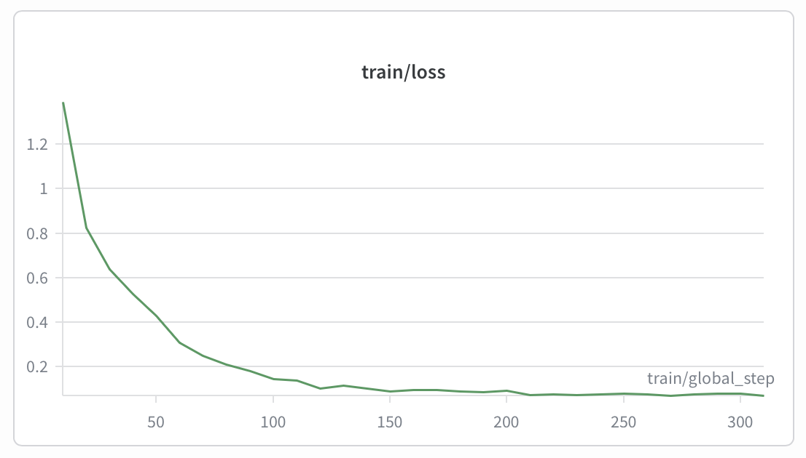
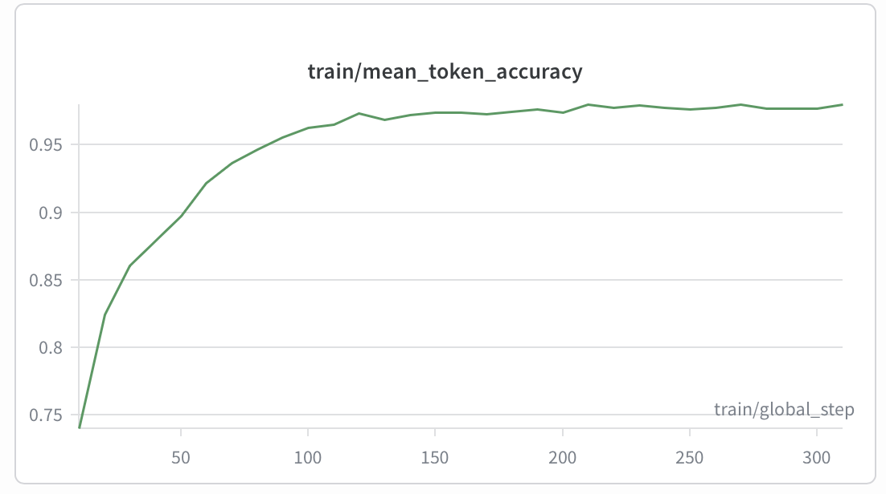
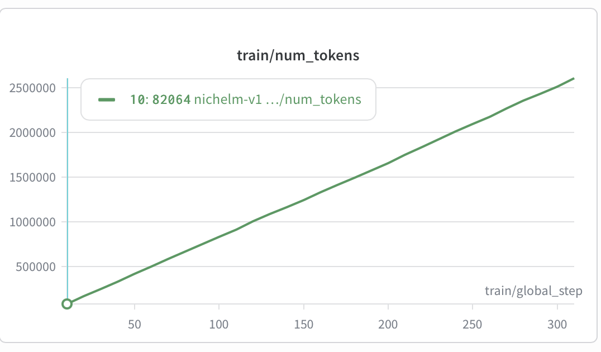
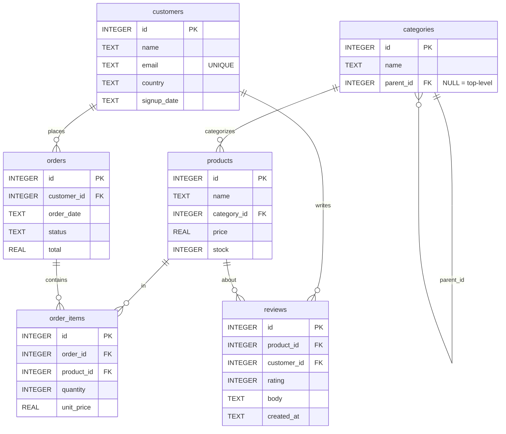

<p align="center">
  
</p>

<h1 align="center">NicheLM</h1>

<p align="center">
  <em>A 3B-parameter text-to-SQL model that matches Claude Haiku 4.5 — at $0 per query.</em>
</p>

<p align="center">
  
  
  
  
  
</p>

---

## TL;DR

|                          | **NicheLM v1**         | Claude Haiku 4.5 | Llama 3.2 3B (base) |
|--------------------------|------------------------|------------------|---------------------|
| **Execution accuracy**   | **85.1 %**             | 85.0 %           | 65.0 %              |
| **Cost per query**       | **$0** (local)         | $0.0006          | $0                  |
| **Mean latency**         | 1.7 s (RTX 4090)       | 0.9 s            | 2.7 s               |
| **Trainable parameters** | 24.3 M (0.75 % of 3 B) | —                | —                   |
| **Training cost**        | ~$0.50 / ~14 min on a 4090 | —            | —                   |

NicheLM is a fine-tuned **Llama 3.2 3B Instruct** that takes a SQL schema and a natural-language question and produces a valid SQLite query. It is **trained on the public Spider dataset** (200+ databases, ~7k pairs) and **evaluated on a held-out, never-seen e-commerce schema**. The target metric is execution accuracy; the goal is to **match or beat Claude Haiku 4.5 at a fraction of the cost per query** — and it does.

## What it does

**System prompt — schema (excerpt):**

```sql
CREATE TABLE customers (id INTEGER PRIMARY KEY, name TEXT, country TEXT, signup_date TEXT);
CREATE TABLE orders   (id INTEGER PRIMARY KEY, customer_id INTEGER, order_date TEXT, total REAL,
                       FOREIGN KEY (customer_id) REFERENCES customers(id));
```

**User question:**

> Which 3 customers from Germany have placed the most orders?

**NicheLM output:**

```sql
SELECT c.name, COUNT(o.id) AS n_orders
FROM customers c
JOIN orders o ON o.customer_id = c.id
WHERE c.country = 'Germany'
GROUP BY c.id
ORDER BY n_orders DESC
LIMIT 3;
```

The model never saw this schema during training. It generalizes from 200+ unrelated Spider databases.

## Headline metrics

First training run complete — QLoRA fine-tune on Spider, evaluated on the held-out e-commerce schema. NicheLM **matches Claude Haiku 4.5 on execution accuracy at $0 per query** (local inference) versus Haiku's $0.0006 per query. Baselines below were sampled at n=20 while the tuned model ran the full n=342 test set; a uniform n=500 sweep is on the roadmap.

| model              | exec_acc  | exact | valid_sql | mean_latency_s | mean_cost_usd | n   |
|--------------------|-----------|-------|-----------|----------------|---------------|-----|
| claude-haiku-4-5   | 0.850     | 0.500 | 1.000     | 0.874          | 0.000602      | 20  |
| llama-3.2-3b-base  | 0.650     | 0.350 | 0.900     | 2.714          | 0.000000      | 20  |
| **nichelm-v1**     | **0.851** | 0.056 | 0.991     | 1.696          | 0.000000      | 342 |

### Training curves

QLoRA fine-tune on a single RTX 4090 — 313 steps, effective batch size 16, ~2.6M tokens seen, total wall time ~14 minutes. Loss collapses fast (Spider is a forgiving format) and converges by step ~150.





## Schema (held-out evaluation harness)



Six tables, foreign keys declared, indexed on every FK, 2-level category hierarchy. See [`data/schema.sql`](data/schema.sql).

## Quick start

```bash
# 1. Offline pipeline (laptop, ~1 min total)
make install                                       # uv sync --extra dev
make seed                                          # creates data/processed/ecom.sqlite
make dataset-eval                                  # creates test.jsonl (500 rows)
make inspect FILE=data/processed/test.jsonl        # eyeball the eval set
make qc                                            # validates against the real DB

# 2. Spider train set (needs `data` extra + network, ~10-15 min)
uv sync --extra dev --extra data
make dataset-train                                 # auto-discovers Spider in HF cache
make inspect FILE=data/processed/train.jsonl SAMPLE=10
make qc                                            # full QC including denylist + overlap

# 3. Baselines (needs `eval` extra + ANTHROPIC_API_KEY in .env)
uv sync --extra dev --extra data --extra eval
make baselines-smoke                               # 5-prompt Claude smoke test (~$0.01)
make baselines                                     # full 500 — includes local Llama (overnight on CPU)
```

Windows / PowerShell — same targets via the bundled wrapper:

```powershell
.\make.ps1 install
.\make.ps1 seed
.\make.ps1 dataset-eval
.\make.ps1 inspect -InspectFile data/processed/test.jsonl
.\make.ps1 qc
.\make.ps1 ci                                      # = lint + test + fixture qc
```

The synthetic e-commerce test set is generated locally and **never overlaps** with Spider's training distribution by construction (see "Decisions" below).

## Project status

- [x] Repo scaffold (CI green: lint + tests + fixture quality check)
- [x] Synthetic e-commerce DB seeded
- [x] Spider train/val JSONL built
- [x] E-commerce 500-question test set built
- [x] Baselines run (Claude Haiku 4.5, raw Llama 3.2 3B)
- [x] First training run (Unsloth QLoRA on RunPod 4090, ~14 min)

## How it's built

**Data.** Training uses `xlangai/spider` from the Hugging Face Hub. Each row's prompt embeds the **full CREATE TABLE statements** for that database in the system message — the same format the model sees at inference time. The eval harness is a fixed e-commerce schema with deterministic Faker-seeded data and a registry of ~30 SQL "shapes" that produce 500 validated (question, SQL) pairs against the seeded DB.

**Train/eval domain isolation.** A small denylist of clearly e-commerce-flavored Spider databases (`e_commerce`, `store_product`, `customers_card_transactions`, …) is excluded from training so the held-out evaluation is genuinely unseen. The denylist lives in [`data/build_train_dataset.py`](data/build_train_dataset.py) and is enforced by `data/quality_check.py`.

**Evaluation.** The primary metric is **execution accuracy** — predicted and gold SQL are both run against a fresh seeded DB and the row sets are compared as sorted lists of tuples. Secondary metrics (exact match after `sqlglot` normalization, valid-SQL rate) are reported but not optimized.

**Training.** Unsloth + TRL `SFTTrainer`, QLoRA rank 16 / alpha 32 on q/k/v/o/gate/up/down proj, 4-bit base, 2 epochs over 5,000 Spider examples at lr 2e-4. Driven by [`train/configs/default.yaml`](train/configs/default.yaml). Designed to fit on a single 24 GB GPU.

## Reproduce locally

Tested on macOS / Linux / WSL. Windows works for the scaffold (lint/test/qc) but the Spider build and baselines need `data` / `eval` extras.

```bash
git clone <this repo>
cd nichelm
cp .env.example .env                       # then fill in real keys

# CI parity (no GPU, no network):
make install                               # uv sync --extra dev
make ci                                    # lint + tests + fixture qc

# Full pipeline (needs network for Spider + API keys for baselines):
uv sync --extra dev --extra data --extra eval
make seed
make dataset                               # uses --seed 42 by default
make qc
make baselines
```

Training and tuned-model eval run on a rented GPU (24 GB+):

```bash
uv sync --extra train
make train                                 # QLoRA fine-tune, writes outputs/nichelm-v1/final/
make eval                                  # runs the checkpoint over test.jsonl
                                           #   override target with: make eval CHECKPOINT=outputs/my-run/final
```

## Limitations

- **One DB engine.** SQLite dialect only (Spider's native dialect for testing). PostgreSQL / MySQL would need re-tokenizing the schema and probably re-tuning.
- **One natural language.** English only; Spider is en-only and so is the e-commerce eval.
- **One target schema for the headline number.** The held-out evaluation is fixed e-commerce. The model is general (Spider trained), but the published exec-accuracy figure speaks to e-commerce transfer specifically.
- **Synthetic data.** The e-commerce DB is Faker-generated. Real-world distributions (long-tail product names, multilingual reviews, NULLs everywhere) are not represented.
- **No agentic loops.** This is a single-shot prompt → SQL model. No tool use, no result-set inspection, no self-correction.

## Decisions

Design choices made during scaffolding, with brief justifications:

- **Spider as training corpus, fixed e-commerce as held-out eval** — the portfolio narrative ("trained on 200 DBs, beats Claude Haiku on a brand new schema") is more compelling than "fine-tuned on a synthetic single-domain set". Confirmed with the user.
- **Schema-in-system-prompt format** — required to generalize across Spider's many DBs; carries no overhead at e-commerce eval time and lets the deployed server work against arbitrary user schemas.
- **Denylist of e-commerce-shaped Spider DBs in training** — keeps the "domain it never saw" claim honest. Documented in `data/build_train_dataset.py::DENYLIST`.
- **Spider DB source: `SALT-NLP/spider_VALUE/data.zip`** — the standard `xlangai/spider` HF dataset is parquet-only (text fields). `SALT-NLP/spider_VALUE/data.zip` is a public mirror of the canonical Yale tarball with all 166 per-DB SQLite files at `data/database/<db_id>/<db_id>.sqlite`. Auto-downloaded by `build_train_dataset.py` to `.hf_cache/spider_databases/` on first run.
- **`max_seq_length = 4096`** — Spider DDL plus a long question can run past 2 k tokens; 4 k gives headroom without halving throughput.
- **`sqlglot` for SQL normalization** — handles SQLite-flavored parsing for exact-match. Falls back to whitespace-lower if a query refuses to parse.
- **Faker `en_US`, fixed seed 42** — full data reproducibility from a single flag.
- **Anthropic model id `claude-haiku-4-5-20251001` (full id)** — the API takes the full id; we keep `claude-haiku-4-5` as the CLI alias for ergonomics.
- **`uv` extras: `dev`, `data`, `eval`, `train`, `serve`** — keeps CI installs lean (just `dev`) so torch / transformers / datasets aren't pulled into a PR check that doesn't need them.
- **Not committing generated data** — `data/processed/*.{jsonl,sqlite}` is `.gitignore`d. Reproduce from `make seed && make dataset` (requires `--seed 42` for byte-identical output).

## Layout

```
nichelm/
├── data/
│   ├── schema.sql              # 6-table e-commerce schema
│   ├── seed.py                 # Faker-seeded SQLite population
│   ├── _common.py              # shared seeding / JSONL / DDL helpers
│   ├── build_train_dataset.py  # Spider → train.jsonl + val.jsonl
│   ├── build_eval_dataset.py   # synthetic e-commerce → test.jsonl
│   └── quality_check.py        # validates everything
├── eval/
│   ├── metrics.py              # execution_accuracy / exact_match / valid_sql_rate
│   ├── run_baselines.py        # Claude Haiku 4.5 + raw Llama 3.2 3B
│   └── run_eval.py             # tuned-checkpoint runner
├── train/
│   ├── train.py                # Unsloth QLoRA (RUN ON GPU ONLY)
│   └── configs/default.yaml
├── serve/
│   ├── server.py               # FastAPI generate endpoint
│   └── Modelfile               # Ollama template (Llama 3.2 chat tokens)
├── tests/                      # pytest + JSONL fixtures (no DB / network)
├── Makefile
├── pyproject.toml              # uv-managed, four optional extras
└── .github/workflows/ci.yml    # lint + test + fixture qc
```

## Author

**Zsombor Horvath** — built as a portfolio project to demonstrate end-to-end LLM fine-tuning:
data pipeline → training → evaluation → serving, all driven by a single `Makefile` and reproducible from `--seed 42`.

Feedback, issues, and pull requests welcome.

## License

[MIT](LICENSE) — free to use, modify, and redistribute.
